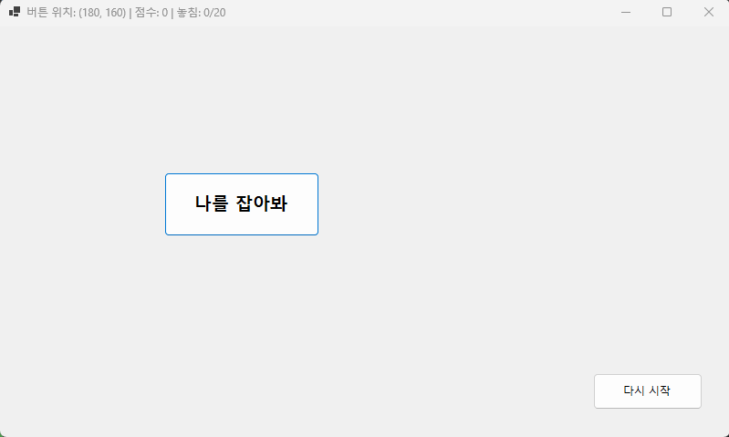
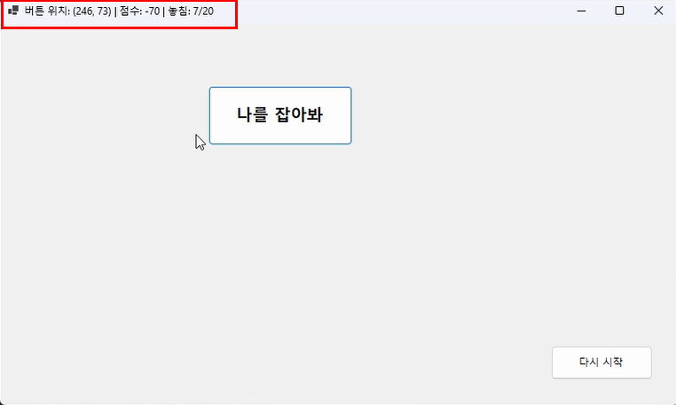
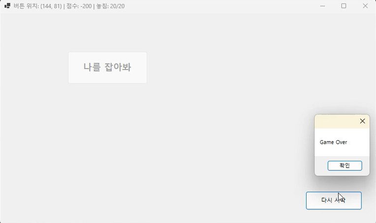
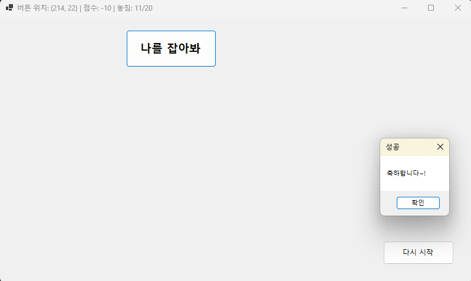

# 02주차 과제: 숨바꼭질버튼
-이름: 이요섭 (23017065)

## 📌 프로그램 소개
CatchButton 프로그램은 C# WinForms를 이용하여 제작한 간단한 인터랙션 프로그램입니다.
사용자가 화면에 나타나는 버튼을 클릭하면 이벤트가 발생하도록 구현하였으며, 이를 통해 Windows Forms 환경에서의 컨트롤 배치와 이벤트 처리 방법을 학습하는 것을 목표로 하였습니다.

## 🛠 개발 환경
 - Language : C#
 - Framework : .NET 8.0
 - IDE : Visual Studio 2026
 - UI Framework : Windows Forms

## 📸 실행 화면
- CatchButton 실행 첫 화면

- Button 클릭 실패시 화면

  (-10점 감점, 놓침 횟수 증가)

- Button 클릭을 20번 실패시 화면

- Button 클릭을 성공했을 때 화면

## 🔥 주요 기능
1️⃣ 버튼 회피 기능
- 마우스가 버튼에 가까워지면 버튼이 마우스를 피해 다른 위치로 이동합니다.

2️⃣ 점수 증가 기능
  - 사용자가 버튼을 클릭하면 점수가 증가합니다.  

3️⃣ 점수 감소 기능
  - 버튼을 클릭하지 못하고 놓치면 점수가 감소합니다.  

4️⃣ 게임 오버 기능
  - 버튼을 20번 놓치면 게임 오버가 발생합니다.

5️⃣ 게임 재시작 기능
  - 게임이 종료된 후 다시 시작할 수 있는 기능을 제공합니다.

## ⚠ 구현 시 어려웠던 점
 - WinForms에서 여러 컨트롤을 원하는 위치에 배치하기 위해 좌표를 계산하는 과정이 처음에는 어려웠습니다. Panel을 기준으로 컨트롤의 위치를 다시 계산하여 문제를 해결하였습니다.
 - 버튼 클릭 이벤트를 통해 프로그램의 동작을 제어하는 이벤트 처리 방식이 처음에는 이해하기 어려웠습니다. 디버깅과 테스트를 반복하면서 이벤트 흐름을 이해할 수 있었습니다.
 - 버튼 클릭에 따라 프로그램 상태가 변경되도록 구현하는 과정에서 변수 관리가 어려웠습니다. 상태를 저장하는 변수를 별도로 선언하여 프로그램 흐름을 안정적으로 제어하였습니다.
 - UI를 구성하는 과정에서 컨트롤의 크기와 정렬이 맞지 않는 문제가 발생하였습니다. Anchor와 Size 속성을 조정하여 화면 크기가 변경되어도 레이아웃이 유지되도록 수정하였습니다.
 - 필요한 기능을 구현하기 위해 다양한 자료를 찾아보고 적용하는 과정이 쉽지 않았지만, Copilot과 여러 개발 자료를 참고하여 문제를 해결할 수 있었습니다.